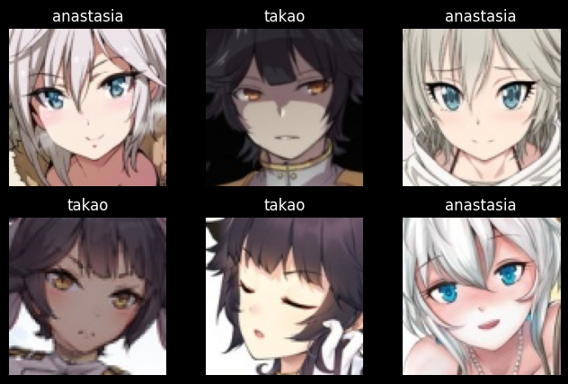
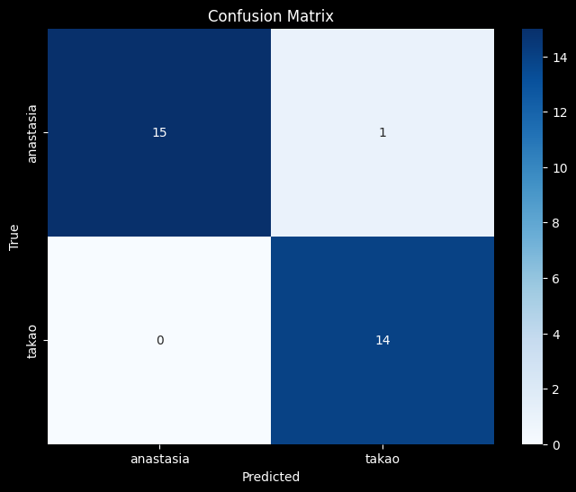
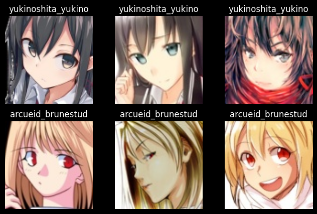
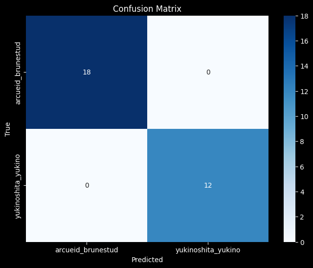

# Anime Image Classification with PyTorch

This project implements two Convolutional Neural Networks (CNNs) to classify anime characters using PyTorch. Both models share the same architecture but are trained on different datasets to distinguish between specific pairs of characters.

## Model Architecture

Both `AnimeClassifier` models utilize a custom CNN architecture designed for image classification tasks. The network consists of two convolutional layers followed by a fully connected layer.

### Architecture Details:
- **Input:** Images (3 channels for RGB)
- **Layer 1:**
    - `Conv2d`: 3 input channels -> 32 output channels, kernel size (3, 3)
    - Activation: `ReLU`
    - Pooling: `MaxPool2d` kernel size (2, 2)
- **Layer 2:**
    - `Conv2d`: 32 input channels -> 16 output channels, kernel size (4, 4)
    - Activation: `ReLU`
    - Pooling: `MaxPool2d` kernel size (2, 2)
- **Flattening:** Converts 2D feature maps to 1D vector
- **Output Layer:**
    - `Linear`: 16 * 14 * 14 input features -> `num_classes` outputs

## Model 1: Anastasia vs. Takao

This model is trained to classify images of **Anastasia** and **Takao**.

- **Dataset Path:** `data`
- **Classes:** `['anastasia', 'takao']`
- **Training:** Trained for 20 epochs using `CrossEntropyLoss` and `Adam` optimizer.
- **Performance:** Achieved ~100% accuracy on both training and validation sets.

### Data Samples


### Performance Evaluation
The model's performance on the validation set is visualized below:



#### Classification Report
```
                  precision    recall  f1-score   support

   anastasia       1.00      0.94      0.97        16
       takao       0.93      1.00      0.97        14

    accuracy                           0.97        30
   macro avg       0.97      0.97      0.97        30
weighted avg       0.97      0.97      0.97        30
```

## Model 2: Arcueid vs. Yukinoshita

This model is trained to classify images of **Arcueid Brunestud** and **Yukinoshita Yukino**.

- **Dataset Path:** `data2`
- **Classes:** `['arcueid_brunestud', 'yukinoshita_yukino']`
- **Training:** Trained for 20 epochs using `CrossEntropyLoss` and `Adam` optimizer.
- **Performance:** Achieved ~100% accuracy on both training and validation sets.

### Data Samples


### Performance Evaluation
The model's performance on the validation set is visualized below:



#### Classification Report
```
                    precision    recall  f1-score   support

 arcueid_brunestud       1.00      1.00      1.00        18
yukinoshita_yukino       1.00      1.00      1.00        12

          accuracy                           1.00        30
         macro avg       1.00      1.00      1.00        30
      weighted avg       1.00      1.00      1.00        30
```